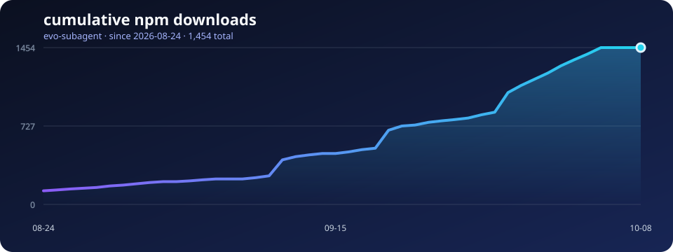

# evo-subagent


[English](README.md) | [简体中文](README.zh-CN.md)

[](https://www.npmjs.com/package/evo-subagent)
[](LICENSE)
[](package.json)

## 下载趋势



图表展示自首次发布以来的 npm 累积下载量，并每天自动更新。DSH Market 使用 npm 下载量进行排序，因此它是最接近公开采用量的指标；但不能区分来自插件市场与直接 npm 安装的下载。

`evo-subagent` 是一个面向 DeepSeek Harness 的 Subagent 路由与项目级进化插件。

它把稳定的 Agent 角色映射到已经注册的 provider/model，为每个角色记录已验证命令与经验，并隔离不同项目的 Agent 知识。

## 功能

- 通过同名 Markdown 绑定文件路由每个 `agent_key`。
- 创建子 Agent 前严格验证 provider/model 组合。
- 自动维护每个 Agent 的 `prefercmd.md` 与 `memory.md`。
- 按项目工作区隔离绑定和进化数据。
- 支持全新上下文的 `spawn` 和继承对话上下文的 `fork`。
- 没有绑定文件时保留 DSH 原生模型继承行为。
- 不保存 API Key、端点、凭据或 provider 定义。

## 安装

需要 DeepSeek Harness `0.1.5-rc.3` 或更高版本，以及 Node.js `>=24.2.0`。

```sh
dsh plugin add evo-subagent
```

## 快速开始


1. 打开 **设置 → 插件**，展开 **evo-subagent**。
2. 选择工作区并添加内置角色，或把自定义绑定放入该工作区的 `agents/` 目录。
3. 为每个自定义绑定选择已经注册的 provider/model 组合。
4. 展开 Agent，即可查看其 `prefercmd.md` 与 `memory.md` 进化文件。

[下载 MP4 教程](assets/evo-subagent-tutorial.mp4)

## 更新日志

每次维护发布都会在顶部增加一条更新记录。

### 0.7.0 — 2026-09-27

- 将开发验证基线更新至 DeepSeek Harness `0.1.5-rc.3`。
- 随插件提供三个 DSH Agent Skill，分别用于路由诊断、进化记忆整理与委派任务设计；技能服务可用时会显示在 DSH 技能列表中。
- 确认子代理路由接口未变化。

### 0.6.1 — 2026-09-19

- 将开发验证基线更新至 DeepSeek Harness `0.1.5-rc.2`。
- 在不改变插件行为的前提下，重新检查路由、工作区进化和设置相关测试。

### 0.6.0 — 2026-09-12

- 适配 DeepSeek Harness `0.1.5-rc.1` 与 Cordis `4.0.2`。
- 为匹配新版 DSH CLI，将 Node.js 最低版本调整为 `>=24.2.0`。
- 已在新版运行时重新验证路由、工作区进化和设置功能。

## Agent 绑定

在项目中创建 `agents/` 目录，每个角色对应一个 Markdown 文件。文件名即 `agent_key`。

```text
project/
├─ agents/
│  ├─ code-reviewer.md
│  └─ researcher.md
└─ .evo_subagent/
   └─ evolution/
```

每个绑定文件以严格的 front matter 开头：

```md
---
provider: deepseek-official
model: deepseek-v4-flash
---

# Code reviewer
下方可以添加可选的角色说明。
```

provider 和 model 必须已经注册，匹配区分大小写。

使用对应的 key 调用插件工具：

```json
{
  "agent_key": "code-reviewer",
  "description": "审查实现",
  "prompt": "报告正确性、安全性和测试覆盖问题。",
  "run_in_background": false
}
```

## 内置角色

插件包含三个模板：

| `agent_key` | 角色 |
| --- | --- |
| `code-reviewer` | 按严重程度输出代码审查结果 |
| `researcher` | 基于证据的研究与核查 |
| `wps-worker` | 办公文档制作 |

项目中存在同名绑定时，项目绑定优先于内置模板。

## 随包提供的 Agent Skill

安装插件后，以下三个兼容 DSH 的技能会注册到 DSH 技能列表。它们用于指导主 Agent，不会增加新的 Subagent 角色。

| Skill | 用途 |
| --- | --- |
| `/evo-route-doctor` | 诊断模型路由不符、继承路径或未注册的 provider/model。 |
| `/evo-memory-review` | 检查角色的 `prefercmd.md` 与 `memory.md`，整理过期或冲突的知识。 |
| `/evo-delegation-guide` | 选择已有角色并准备边界明确的委派任务。 |

DSH 需要启用技能注册服务和技能工具才能显示这些条目。项目内同名技能可覆盖随包技能。技能文件也随 npm 包保存在 `skills/` 下。

## 进化

每个项目的角色知识保存在：

```text
.evo_subagent/evolution/<agent_key>/prefercmd.md
.evo_subagent/evolution/<agent_key>/memory.md
```

- `prefercmd.md` 记录已经验证可用的命令。
- `memory.md` 记录可复用经验和需要避免的失败。

前台 Subagent 会接收一段有长度限制的知识上下文，并可通过以下格式返回新内容：

```md
[[EVOLUTION]]
prefercmd:
- pnpm test
memory:
- 不要在 CI 中使用 --force。
[[/EVOLUTION]]
```

条目会去重并限制数量。使用 `!` 前缀标记最高优先级，使用 `?` 标记可在上下文紧张时压缩的条目。

旧 `.smart_subagent/evolution` 数据仍可只读回退，并会在下次保存时复制到新目录。

## 工作区管理

插件设置卡片按项目分组 Agent，并支持：

- 展开或折叠工作区 Agent 列表；
- 编辑自定义绑定的已注册 provider/model 路由；
- 将内置角色模板复制到指定工作区；
- 绑定一个工作区根目录的 `AGENTS.md` 作为 Main agent；
- 查看和编辑每个 Agent 的进化文件。

Main agent 的进化数据位于 `.evo_subagent/evolution/main/`。绑定或解绑只会修改 `AGENTS.md` 中由插件管理的指令区块。

## 工具字段

| 字段 | 必填 | 说明 |
| --- | --- | --- |
| `agent_key` | 是 | 不含 `.md` 的绑定文件名。 |
| `description` | 是 | 简短任务名称。 |
| `prompt` | 是 | 发送给子 Agent 的完整任务。 |
| `run_in_background` | 否 | 默认 `true`；设为 `false` 时可收集进化输出。 |

## 路由流程

1. 安全解析 `<agent_key>.md`。
2. 读取 fenced front matter 中的 `provider` 和 `model`。
3. 在实时模型注册表中验证两个值。
4. 通过所选 `spawn` 或 `fork` provider 创建子 Agent。

无效绑定会在创建子 Agent 前失败。绑定缺失且没有同名内置模板时，保留 DSH 原生继承行为。

## 开发

需要 Node.js 24.2 或更高版本。

```sh
npm test
npm run check
npm pack --dry-run
```

## 许可证

[MIT](LICENSE)
